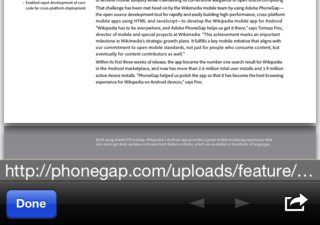

cordova-plugin-inappbrowser
-----------------------------
Modified for iOS. Adds a button to the InAppBrowser that opens the document with an external application.

 &nbsp;

These modifications were based on Andrew Trice's [ExternalFileUtil](https://github.com/phonegap/phonegap-plugins/tree/master/iOS/ExternalFileUtil) plugin.

To install this plugin, follow the [Command-line Interface Guide](http://cordova.apache.org/docs/en/edge/guide_cli_index.md.html#The%20Command-line%20Interface).

If you are not using the Cordova Command-line Interface, follow [Using Plugman to Manage Plugins](http://cordova.apache.org/docs/en/edge/guide_plugin_ref_plugman.md.html).
